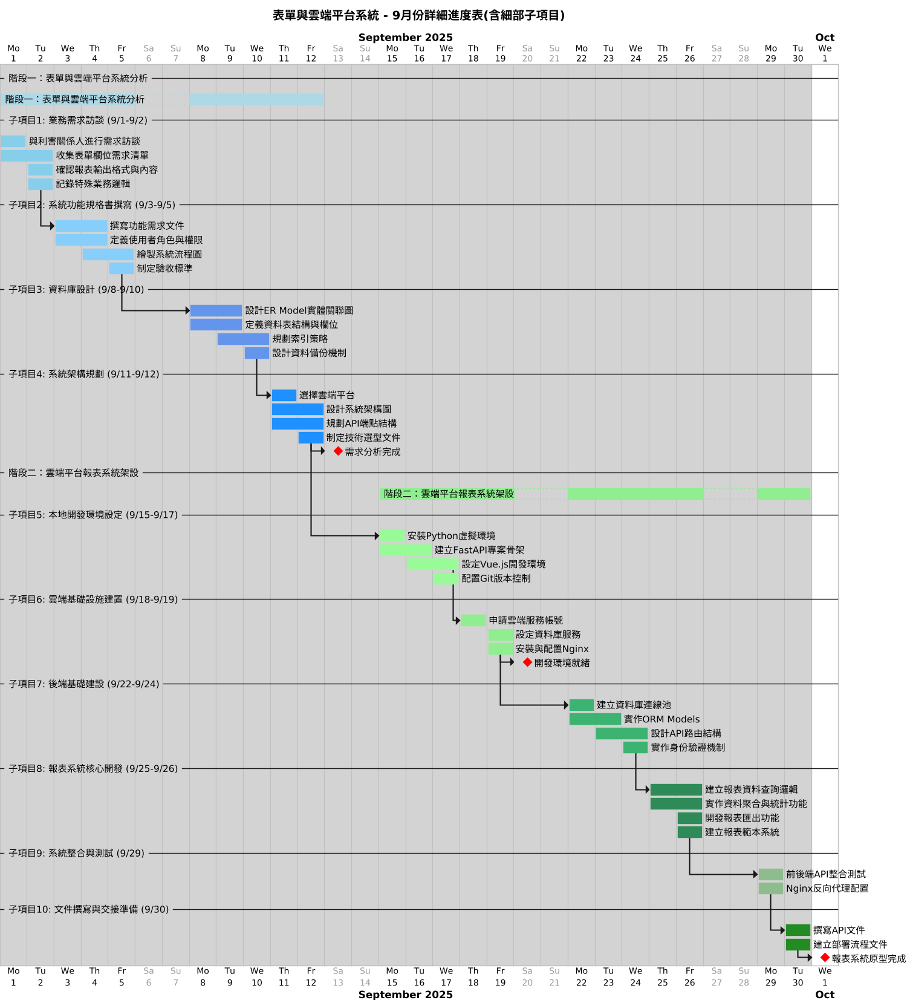

# 表單與雲端平台系統 - 9月份詳細進度表

## 📊 甘特圖

*圖：表單與雲端平台系統 9月份完整甘特圖*

---

## 📋 專案總覽

**專案名稱**：表單與雲端平台系統 - 9月份詳細進度表  
**專案期間**：2025-09-01 至 2025-09-30  
**工作日設定**：週一至週五（週六、日休息）

---

## 📊 階段一：表單與雲端平台系統分析（9/1 - 9/12）

| 子項目編號 | 子項目名稱 | 任務項目 | 開始日期 | 持續天數 | 結束日期 |
|----------|----------|---------|---------|---------|---------|
| **1** | **業務需求訪談** | | | | |
| 1.1 | 與利害關係人進行需求訪談 | T1_1 | 2025-09-01 | 1天 | 2025-09-01 |
| 1.2 | 收集表單欄位需求清單 | T1_2 | 2025-09-01 | 2天 | 2025-09-02 |
| 1.3 | 確認報表輸出格式與內容 | T1_3 | 2025-09-02 | 1天 | 2025-09-02 |
| 1.4 | 記錄特殊業務邏輯 | T1_4 | 2025-09-02 | 1天 | 2025-09-02 |
| **2** | **系統功能規格書撰寫** | | | | |
| 2.1 | 撰寫功能需求文件 | T2_1 | 2025-09-03 | 2天 | 2025-09-04 |
| 2.2 | 定義使用者角色與權限 | T2_2 | 2025-09-03 | 2天 | 2025-09-04 |
| 2.3 | 繪製系統流程圖 | T2_3 | 2025-09-04 | 2天 | 2025-09-05 |
| 2.4 | 制定驗收標準 | T2_4 | 2025-09-05 | 1天 | 2025-09-05 |
| **3** | **資料庫設計** | | | | |
| 3.1 | 設計ER Model實體關聯圖 | T3_1 | 2025-09-08 | 2天 | 2025-09-09 |
| 3.2 | 定義資料表結構與欄位 | T3_2 | 2025-09-08 | 2天 | 2025-09-09 |
| 3.3 | 規劃索引策略 | T3_3 | 2025-09-09 | 2天 | 2025-09-10 |
| 3.4 | 設計資料備份機制 | T3_4 | 2025-09-10 | 1天 | 2025-09-10 |
| **4** | **系統架構規劃** | | | | |
| 4.1 | 選擇雲端平台 | T4_1 | 2025-09-11 | 1天 | 2025-09-11 |
| 4.2 | 設計系統架構圖 | T4_2 | 2025-09-11 | 2天 | 2025-09-12 |
| 4.3 | 規劃API端點結構 | T4_3 | 2025-09-11 | 2天 | 2025-09-12 |
| 4.4 | 制定技術選型文件 | T4_4 | 2025-09-12 | 1天 | 2025-09-12 |

### 🎯 階段一里程碑

| 里程碑 | 日期 |
|--------|------|
| **需求分析完成** (M1) | 2025-09-12 |

---

## 📊 階段二：雲端平台報表系統架設（9/15 - 9/30）

| 子項目編號 | 子項目名稱 | 任務項目 | 開始日期 | 持續天數 | 結束日期 |
|----------|----------|---------|---------|---------|---------|
| **5** | **本地開發環境設定** | | | | |
| 5.1 | 安裝Python虛擬環境 | T5_1 | 2025-09-15 | 1天 | 2025-09-15 |
| 5.2 | 建立FastAPI專案骨架 | T5_2 | 2025-09-15 | 2天 | 2025-09-16 |
| 5.3 | 設定Vue.js開發環境 | T5_3 | 2025-09-16 | 2天 | 2025-09-17 |
| 5.4 | 配置Git版本控制 | T5_4 | 2025-09-17 | 1天 | 2025-09-17 |
| **6** | **雲端基礎設施建置** | | | | |
| 6.1 | 申請雲端服務帳號 | T6_1 | 2025-09-18 | 1天 | 2025-09-18 |
| 6.2 | 設定資料庫服務 | T6_2 | 2025-09-19 | 1天 | 2025-09-19 |
| 6.3 | 安裝與配置Nginx | T6_3 | 2025-09-19 | 1天 | 2025-09-19 |
| **7** | **後端基礎建設** | | | | |
| 7.1 | 建立資料庫連線池 | T7_1 | 2025-09-22 | 1天 | 2025-09-22 |
| 7.2 | 實作ORM Models | T7_2 | 2025-09-22 | 2天 | 2025-09-23 |
| 7.3 | 設計API路由結構 | T7_3 | 2025-09-23 | 2天 | 2025-09-24 |
| 7.4 | 實作身份驗證機制 | T7_4 | 2025-09-24 | 1天 | 2025-09-24 |
| **8** | **報表系統核心開發** | | | | |
| 8.1 | 建立報表資料查詢邏輯 | T8_1 | 2025-09-25 | 2天 | 2025-09-26 |
| 8.2 | 實作資料聚合與統計功能 | T8_2 | 2025-09-25 | 2天 | 2025-09-26 |
| 8.3 | 開發報表匯出功能 | T8_3 | 2025-09-26 | 1天 | 2025-09-26 |
| 8.4 | 建立報表範本系統 | T8_4 | 2025-09-26 | 1天 | 2025-09-26 |
| **9** | **系統整合與測試** | | | | |
| 9.1 | 前後端API整合測試 | T9_1 | 2025-09-29 | 1天 | 2025-09-29 |
| 9.2 | Nginx反向代理配置 | T9_2 | 2025-09-29 | 1天 | 2025-09-29 |
| **10** | **文件撰寫與交接準備** | | | | |
| 10.1 | 撰寫API文件 | T10_1 | 2025-09-30 | 1天 | 2025-09-30 |
| 10.2 | 建立部署流程文件 | T10_2 | 2025-09-30 | 1天 | 2025-09-30 |

### 🎯 階段二里程碑

| 里程碑 | 日期 |
|--------|------|
| **開發環境就緒** (M2) | 2025-09-19 |
| **報表系統原型完成** (M3) | 2025-09-30 |

---

